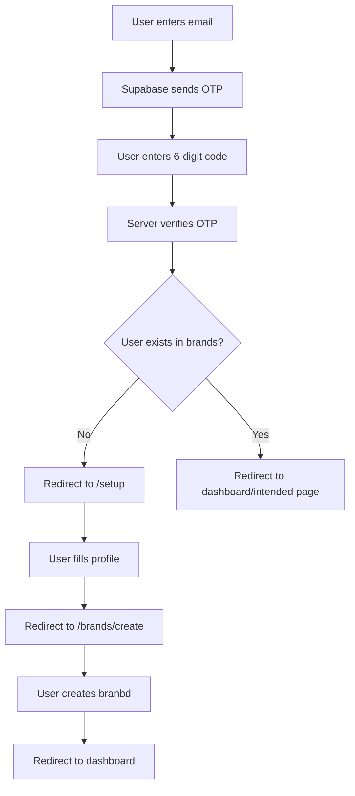
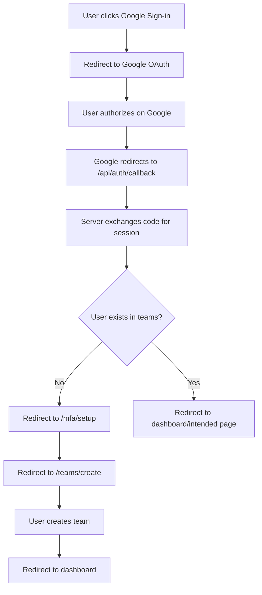

# Midday Authentication System - Comprehensive Guide

## 📋 Table of Contents
1. [Login vs Signup Differentiation](#login-vs-signup-differentiation)
2. [Google Authentication](#google-authentication)
3. [Email OTP Authentication](#email-otp-authentication)
4. [User Account Creation](#user-account-creation)
5. [Team Creation & Management](#team-creation--management)
6. [Authentication Verification System](#authentication-verification-system)
7. [Authentication Flow Overview](#authentication-flow-overview)
8. [File Structure](#file-structure)

---

## 🔐 Login vs Signup Differentiation

### **Key Principle: No Explicit Differentiation**
Midday uses a **unified authentication approach** where there's no separate "login" vs "signup" flow. The system automatically handles both cases:

1. **Existing User**: Redirects to dashboard or intended page
2. **New User**: Automatically creates account and guides through onboarding

### **Detection Logic** (in `/api/auth/callback/route.ts`):
```typescript
// After successful authentication
if (session) {
  const userId = session.user.id;
  
  // Check if user has any teams (indicates existing user)
  const { count } = await supabase
    .from("users_on_team")
    .select("*", { count: "exact" })
    .eq("user_id", userId);

  // New user flow
  if (count === 0 && !returnTo?.startsWith("teams/invite/")) {
    return NextResponse.redirect(`${requestUrl.origin}/teams/create`);
  }
  
  // Existing user flow - redirect to intended destination
}
```

---

## 🔍 Google Authentication

### **How Google Auth Works**:
1. **Provider Setup**: Uses Supabase's Google OAuth provider
2. **Redirect Flow**: 
   - User clicks Google sign-in → Redirects to Google OAuth
   - Google redirects back to `/api/auth/callback`
   - Callback handler processes the authentication

### **Login vs Signup Detection**:
- **Same logic as above** - checks `users_on_team` count
- **Account Creation**: Supabase automatically creates user in `auth.users`
- **Profile Creation**: Webhook triggers profile creation in `public.users`

### **Google-Specific Components**:
- **File**: `apps/dashboard/src/components/google-sign-in.tsx`
- **Implementation**: Standard Supabase OAuth flow
- **User Data**: Google provides email, name, profile picture automatically

---

## 📧 Email OTP Authentication

### **How OTP Authentication Works**:

#### **1. OTP Request Flow**:
```typescript
// In otp-sign-in.tsx
async function onSubmit({ email }: z.infer<typeof formSchema>) {
  setLoading(true);
  setEmail(email);
  
  // Supabase generates and sends OTP
  await supabase.auth.signInWithOtp({ email });
  
  setSent(true); // Shows OTP input UI
  setLoading(false);
}
```

#### **2. OTP Verification Flow**:
```typescript
// When user completes 6-digit OTP
async function onComplete(token: string) {
  verifyOtp.execute({
    token,
    email,
    redirectTo: `${window.location.origin}/${searchParams.get("return_to") || ""}`,
  });
}
```

#### **3. Server-Side Verification** (`/actions/verify-otp-action.ts`):
```typescript
await supabase.auth.verifyOtp({
  email,
  token,
  type: "email",
});

// Set preferred sign-in method cookie (1 year expiry)
(await cookies()).set(Cookies.PreferredSignInProvider, "otp", {
  expires: addYears(new Date(), 1),
});
```

### **OTP Token Details**:
- **Format**: 6-digit numeric code
- **Validity**: **5-10 minutes** (Supabase default, configurable)
- **Generation**: Handled entirely by Supabase
- **Storage**: Stored in `auth.users` table (`confirmation_token`, `confirmation_sent_at`)
- **Delivery**: Email sent via Supabase's email service

### **Login vs Signup Detection**:
- **Identical to Google Auth** - uses team membership count
- **No distinction** at OTP level - same flow for both cases

---

## 👤 User Account Creation

### **Account Creation Process**:

#### **1. Authentication Level** (Supabase `auth.users`):
- **Automatic**: Created by Supabase during first successful OTP/OAuth
- **Data Stored**: `id`, `email`, `email_confirmed_at`, `last_sign_in_at`, etc.

#### **2. Profile Level** (`public.users`):
- **Trigger**: Database webhook calls `/api/webhook/registered`
- **Initial Data**: `id` (from auth.users), `email`, minimal profile data

#### **3. Profile Setup** (`/setup` page):
**Required Information**:
- **Full Name** (required, 2-32 characters)
- **Avatar/Profile Picture** (optional)

**Implementation (tRPC)**:
```typescript
const formSchema = z.object({ full_name: z.string().min(2) });

// Optional avatar upload via Supabase Storage (client)
// then update profile via tRPC
updateUserMutation.mutate({ full_name, avatar_url });
```

#### **4. Additional User Fields**:
- `locale` (default: "en")
- `timeFormat` (default: 24)
- `timezone`, `dateFormat` (optional)

---

## 🏢 Brand Creation & Management

### **Brand Creation Process**:

#### **1. Brand Creation Form** (`/brands/create`):
**Required Information**:
- **Brand/Company Name** (required)
- **Country** (dropdown; ISO alpha‑2 via shared countries list)
- **Logo** (optional)

#### **2. API (tRPC) create flow** (`apps/api/src/trpc/routers/brand.ts`):
```ts
create: protectedProcedure
  .input(z.object({ name: z.string().min(1), country_code: z.string().optional().nullable() }))
  .mutation(async ({ ctx, input }) => {
    const { supabase, user } = ctx;
    const { data: brand } = await supabase
      .from("brands")
      .insert({ name: input.name, country_code: input.country_code ?? null, created_by: user.id })
      .select("id")
      .single();

    await supabase.from("users_on_brand").insert({ user_id: user.id, brand_id: brand.id, role: "owner" });
    await supabase.from("users").update({ brand_id: brand.id }).eq("id", user.id);
    return { id: brand.id } as const;
  });
```

#### **3. Brand-User Relationship**:
- **`users.brandId`**: User's currently active team
- **`users_on_brand`**: Many-to-many relationship with roles
- **Roles**: `"owner"`, `"member"` (extensible enum)
- **Brand Switching**: Updates `users.brandId` without URL changes

### **Brand Features**:
    // - **Inbox ID**: Auto-generated unique inbox identifier (not sure what this is for)
- **Plans**: `"trial"` (default), extensible for paid plans
- **Settings**: Document classification, inbox forwarding, etc.

---

## 🔒 Authentication Verification System

### **Session Management**:

#### **1. Cookie-Based Sessions**:
- **Technology**: Supabase uses **httpOnly cookies** for session management
- **Cookie Names**: `sb-<project-ref>-auth-token` (access token), `sb-<project-ref>-auth-token.1` (refresh token)
- **Validity**: 
  - **Access Token**: 1 hour
  - **Refresh Token**: 30 days (auto-refreshes access token)
- **Security**: httpOnly, Secure, SameSite attributes

#### **2. JWT Structure**:
```typescript
type SupabaseJWTPayload = JWTPayload & {
  aud: "authenticated";
  exp: number;
  sub: string; // user ID
  email?: string;
  phone?: string;
  user_metadata?: Record<string, any>;
};
```

### **Request Verification Flow**:

#### **1. Server-Side Verification** (`/api/utils/auth.ts`):
```typescript
export async function verifyAccessToken(accessToken?: string): Promise<Session | null> {
  if (!accessToken) return null;
  
  const supabase = await createClient();
  const { data: { user }, error } = await supabase.auth.getUser(accessToken);
  
  return user ? { user } : null;
}
```

#### **4. Country Selector UI**
- Searchable combobox built with shadcn `Popover` + `Command` from `@v1/ui`.
- Backed by `@v1/location/countries` map: `Record<code, { code; name; emoji; unicode }>`.
- Reusable `CountrySelect` with label-above UX matching `TextField`.
    // what is TRPC?
#### **2. TRPC Context Creation** (`/trpc/init.ts`):
```typescript
export const createTRPCContext = async (_, c: Context) => {
  const accessToken = c.req.header("Authorization")?.split(" ")[1];
  const session = await verifyAccessToken(accessToken);
  const supabase = await createClient(accessToken);
  const db = await connectDb();
  
  return { session, supabase, db, geo };
};
```

#### **3. Brand Permission Middleware**:
```typescript
// Caching layer (30min TTL, 5k entries)
const cache = new LRUCache<string, boolean>({
  max: 5_000,
  ttl: 1000 * 60 * 30,
});

// Permission check with caching
const cacheKey = `user:${userId}:brand:${brandId}`;
let hasAccess = cache.get(cacheKey);

if (hasAccess === undefined) {
  hasAccess = result.usersOnBrand.some(membership => membership.brandId === brandId);
  cache.set(cacheKey, hasAccess);
}
```

### **Row Level Security (RLS)**:
Every brand-scoped table uses policies like:
```sql
CREATE POLICY "Data can be accessed by brand members" ON "table_name"
AS PERMISSIVE FOR ALL TO public 
USING ((brand_id IN ( SELECT private.get_brands_for_authenticated_user() )));
```

RLS insert/select nuance for brand creation:
- Insert is allowed when `created_by = auth.uid()`.
- Immediately reading the inserted row (INSERT ... RETURNING) is allowed via a select policy that permits either membership or creator access.

```sql
-- apps/api/supabase/migrations/20240901171000_fix_brands_select_policy.sql
drop policy if exists brands_select_for_members on public.brands;
create policy brands_select_for_members on public.brands
for select to authenticated
using (
  public.is_brand_member(brands.id)
  or brands.created_by = auth.uid()
);
```

---

## 📊 Authentication Flow Overview

### **OTP Authentication Flow**:


### **Google Authentication Flow**:


---

## 📁 File Structure

### **Authentication Components**:
```
apps/dashboard/src/components/
├── otp-sign-in.tsx              # OTP email authentication form
├── google-sign-in.tsx           # Google OAuth button
├── apple-sign-in.tsx            # Apple OAuth button  
├── github-sign-in.tsx           # GitHub OAuth button
├── setup-form.tsx               # User profile setup form
├── team-dropdown.tsx            # Team switching component
├── team-invite.tsx              # Team invitation handling
├── verify-mfa.tsx               # MFA verification component
├── enroll-mfa.tsx               # MFA enrollment component
└── forms/
    └── create-team-form.tsx     # Team creation form
```

### **Authentication Pages**:
```
apps/dashboard/src/app/[locale]/
├── (public)/
│   └── login/
│       └── page.tsx             # Main login page
├── (app)/
│   ├── setup/
│   │   └── page.tsx             # User profile setup
│   ├── teams/
│   │   ├── page.tsx             # Team selection/management
│   │   └── create/
│   │       └── page.tsx         # Team creation
│   └── mfa/
│       ├── setup/
│       │   └── page.tsx         # MFA setup
│       └── verify/
│           └── page.tsx         # MFA verification
```

### **Authentication Actions**:
```
apps/dashboard/src/actions/
├── verify-otp-action.ts         # Server action for OTP verification
├── mfa-verify-action.ts         # MFA verification action
└── safe-action.ts               # Base action client with auth
```

### **Authentication APIs**:
```
apps/dashboard/src/app/api/
├── auth/
│   └── callback/
│       └── route.ts             # OAuth callback handler
└── webhook/
    └── registered/
        └── route.ts             # User registration webhook
```

### **Authentication Utilities**:
```
apps/dashboard/src/utils/
└── constants.ts                 # Cookie names and constants
```

### **TRPC Authentication**:
```
apps/api/src/trpc/
├── init.ts                      # TRPC context creation
├── middleware/
│   ├── team-permission.ts       # Team access verification
│   └── primary-read-after-write.ts
└── routers/
    ├── user.ts                  # User management endpoints
    └── team.ts                  # Team management endpoints
```

### **Database Queries**:
```
apps/api/src/db/queries/
├── users.ts                     # User CRUD operations
├── teams.ts                     # Team CRUD operations
├── users-on-team.ts             # Team membership queries
└── user-invites.ts              # Team invitation queries
```

### **Authentication Services**:
```
apps/api/src/
├── utils/
│   └── auth.ts                  # JWT verification utilities
└── services/
    └── supabase.ts              # Supabase client configuration
```

### **Supabase Package**:
```
packages/supabase/src/
├── client/
│   ├── client.ts                # Browser Supabase client
│   ├── server.ts                # Server Supabase client
│   ├── middleware.ts            # Next.js middleware integration
│   └── job.ts                   # Background job client
├── types/
│   ├── db.ts                    # Database type definitions
│   └── index.ts                 # Exported types
├── mutations/
│   └── index.ts                 # Database mutations
└── queries/
    ├── index.ts                 # Database queries
    └── cached-queries.ts        # Cached query implementations
```

### **Database Schema & Migrations**:
```
apps/api/src/db/
├── schema.ts                    # Complete database schema with RLS policies
└── migrations/
    ├── 0000_bumpy_chat.sql      # Initial migration with all tables
    └── meta/
        └── 0000_snapshot.json   # Migration metadata
```

This comprehensive structure shows how Midday implements a **robust, multi-tenant authentication system** with seamless user experience, strong security through RLS policies, and efficient team-based data isolation.

---

## 🚀 Current Implementation Status (Avelero) — OTP & OAuth Auth (YYYY-MM-DD)

### What’s implemented
- **Login UI**: The `/[locale]/(public)/login` page shows Google OAuth and Email sign-in. Email flow switches to a 6‑digit OTP input after email submission.
  - Files: `apps/app/src/app/[locale]/(public)/login/page.tsx`, `apps/app/src/components/login-form.tsx`, `apps/app/src/components/email-signin.tsx`, `apps/app/src/components/google-signin.tsx`, `apps/app/src/components/otp-verify.tsx`

- **OTP flow (server actions + Supabase)**: 
  - Request OTP via `sendOtpAction` → `supabase.auth.signInWithOtp`.
  - Verify OTP via `verifyOtpAction` → `supabase.auth.verifyOtp`.
  - On success, session cookies are set by the Supabase server client; we then redirect using a centralized policy.
  - Files: `apps/app/src/actions/auth/send-otp-action.ts`, `apps/app/src/actions/auth/verify-otp-action.ts`

- **Email delivery via Edge Function + Resend**:
  - Supabase function intercepts OTP emails and sends using Resend with our React email template.
  - Files: `apps/api/supabase/functions/send-email/index.ts`, `apps/api/supabase/functions/import_map.json`, `apps/api/supabase/functions/deno.json`, `apps/api/supabase/config.toml`, `packages/email/emails/otp.tsx`

- **Centralized redirect policy**:
  - Introduced and updated `resolveAuthRedirectPath` to unify post-auth routing for both OAuth callbacks and OTP verification.
  - Behavior:
    - If profile is incomplete (missing `users.full_name`), redirect to `/setup`.
    - Else if user has no brand memberships and `return_to` is not an invite path (`brands/invite/...`), redirect to `/brands/create`.
    - Else use `return_to` → `next` → `/`.
  - Files: `apps/app/src/lib/auth-redirect.ts`, `apps/app/src/app/api/auth/callback/route.ts`, `apps/app/src/actions/auth/verify-otp-action.ts`

- **OAuth callback**:
  - Exchanges `code` when present (OAuth/PKCE). For OTP, no code is expected; route still resolves redirect using the shared helper.
  - Uses `supabase.auth.getUser()` (server-validated) instead of reading raw session to avoid warnings.
  - Files: `apps/app/src/app/api/auth/callback/route.ts`

- **Cookie & JWT verification**:
  - Enforce auth on protected pages/actions using `@v1/supabase/server` in RSC/route handlers and `getUser()` checks.
  - Consider middleware (`packages/supabase/src/clients/middleware.ts`) to keep sessions fresh and block unauthenticated access to dashboard routes.
  - Ensure RLS is complemented by application‑level brand checks.

- **Profile setup (UI + tRPC)**:
  - `/[locale]/(dashboard)/setup` page implemented.
  - Requires `full_name` (mandatory) and lets users upload an optional avatar (converted to WebP client-side and stored in Supabase Storage `avatars` bucket).
  - Updates profile via `trpc.user.update` and redirects client-side based on brand membership.
  - Files: `apps/app/src/app/[locale]/(dashboard)/setup/page.tsx`, `apps/app/src/components/forms/setup-form.tsx`, `apps/app/src/components/avatar-upload.tsx`, `apps/app/src/components/text-field.tsx`.

- **Brand creation (UI + tRPC)**:
  - `/[locale]/(dashboard)/brands/create` page implemented.
  - Form: brand name (required) + country (dropdown via `@v1/location/countries`).
  - On submit, calls `trpc.brand.create` which inserts the brand, creates `users_on_brand` owner membership, and sets `users.brand_id`; then the client redirects to `/`.
  - Files: `apps/app/src/app/[locale]/(dashboard)/brands/create/page.tsx`, `apps/app/src/components/forms/create-brand-form.tsx`, `apps/app/src/components/country-select.tsx`, `apps/api/src/trpc/routers/brand.ts`, `packages/location/src/countries.ts`.

- **Brand system (DB + RLS)**:
  - Tables: `public.brands`, `public.users_on_brand`, `public.users.brand_id` (active brand).
  - Helper SQL functions to avoid recursive policies: `public.get_brands_for_authenticated_user()`, `public.is_brand_member(uuid)`, `public.is_brand_owner(uuid)`, `public.is_brand_creator(uuid)`.
  - Policies reference helper functions to prevent infinite recursion.
  - Files: `apps/api/supabase/migrations/20240901170000_create_brands_system.sql`, `packages/supabase/src/types/db.ts`.

- **Supabase Storage (avatars)**:
  - Bucket: `avatars` (public read).
  - Policies:
    - Insert: authenticated users can upload when `bucket_id = 'avatars'` and path starts with `auth.uid()` (via `path_tokens[1] = (auth.uid())::text`).
    - Select: public read on `avatars`.
    - Update/Delete: permitted to the owner (same path-token rule).
  - Files: `apps/api/supabase/migrations/20240901170500_create_avatars_bucket.sql`.

- **Temporary testing controls**:
  - Add temporary “Delete account”, “Delete brand”, and a brand selector dropdown to facilitate manual testing.

### Files changed in this iteration
- `apps/app/src/app/api/auth/callback/route.ts`
- `packages/email/emails/otp.tsx`
- `apps/app/src/app/[locale]/(public)/login/layout.tsx` (when applicable)
- `apps/app/src/app/[locale]/(public)/login/page.tsx`
- `apps/api/supabase/functions/send-email/index.ts`
- `apps/api/supabase/functions/import_map.json`
- `apps/api/supabase/functions/deno.json`
- `apps/api/supabase/config.toml`
- `apps/app/src/actions/auth/send-otp-action.ts`
- `apps/app/src/actions/auth/verify-otp-action.ts`
- `apps/app/src/components/email-signin.tsx`
- `apps/app/src/components/google-signin.tsx`
- `apps/app/src/components/login-form.tsx`
- `apps/app/src/components/otp-verify.tsx`
- `apps/app/src/middleware.ts`
- `apps/app/src/actions/safe-action.ts`
 - `apps/app/src/lib/auth-redirect.ts`
 - `apps/app/src/app/[locale]/(dashboard)/setup/page.tsx`
 - `apps/app/src/components/setup/setup-form.tsx`
 - `apps/app/src/components/forms/avatar-upload.tsx`
 - `apps/app/src/components/forms/text-field.tsx`
 - `apps/app/src/actions/user/complete-profile-action.ts`
 - `apps/api/supabase/migrations/20240901170000_create_brands_system.sql`
 - `apps/api/supabase/migrations/20240901170500_create_avatars_bucket.sql`
 - `packages/supabase/src/mutations/index.ts`
 - `packages/supabase/src/queries/index.ts`
 - `packages/supabase/src/types/db.ts`
  - `apps/app/src/app/[locale]/(dashboard)/brands/create/page.tsx`
  - `apps/app/src/components/brands/create-brand-form.tsx`
  - `apps/app/src/components/forms/country-select.tsx`
  - `apps/app/src/actions/brand/create-brand-action.ts`
  - `packages/location/src/countries.ts`
  - `apps/app/next.config.mjs` (added `@v1/location` to `transpilePackages`)

### Open items / To‑Dos

- Reflect brand membership in auth checks and UI visibility; prevent cross‑brand data leakage.

- **Invitations**:
  - Implement invite issuance (email) and acceptance.
  - On acceptance, redirect invitees through login; after `/setup`, skip `/brands/create` and land on the invited brand’s home.
  - If multiple invites are accepted, add the user to all invited brands; redirect to the most recently accepted brand. Ensure `resolveAuthRedirectPath` respects invite context (already partially handled via `brands/invite/...`).

### Notes
- Redirect policy is centralized in `apps/app/src/lib/auth-redirect.ts` and consumed by both OTP and OAuth flows, keeping behavior consistent and easy to evolve. It now checks profile completeness before brand membership.
- The setup form uploads avatars as WebP to Supabase Storage under `avatars/<userId>/...` and updates `public.users` accordingly. The action returns a redirect URL that the client navigates to for a smoother dev experience.
- OTP code delivery is decoupled via the Supabase Edge Function and Resend template, enabling branded emails without changing the auth core.